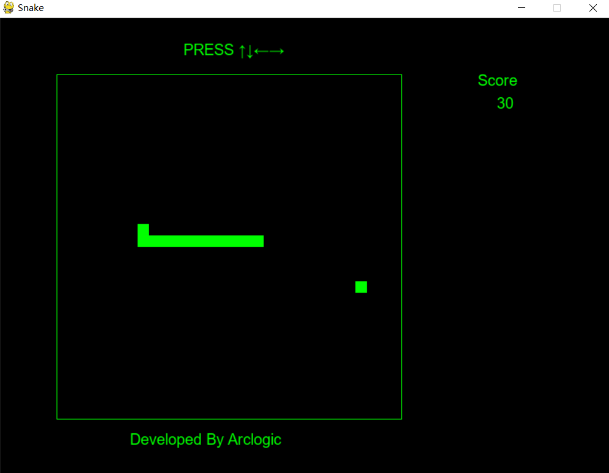

[中文](https://github.com/arclogicR/snake "贪吃蛇")
# snake

This is a brief sanke game developed by using python，and you can using direction keys to move the snake.

## environment

python version 3.7.5

## requirements

pygame 2.1.2 (SDL 2.0.18, Python 3.7.5)

needs to put a font file in current directory, default is arial.ttf

## 贪吃蛇

使用python开发的一个简单的贪吃蛇游戏，使用光标键控制移动

## 环境：

python版本3.7.5

## 所需包：

pygame 2.1.2 (SDL 2.0.18, Python 3.7.5)

需要指定字体文件，默认为当前目录下arial.ttf
